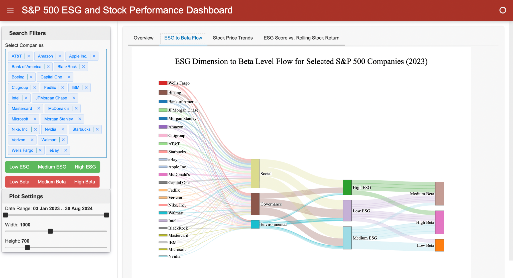
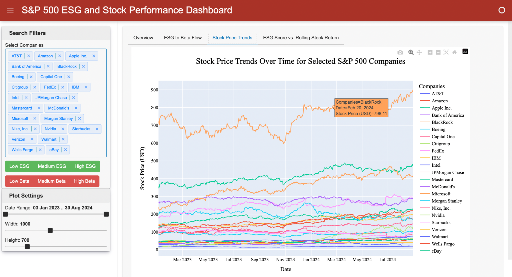
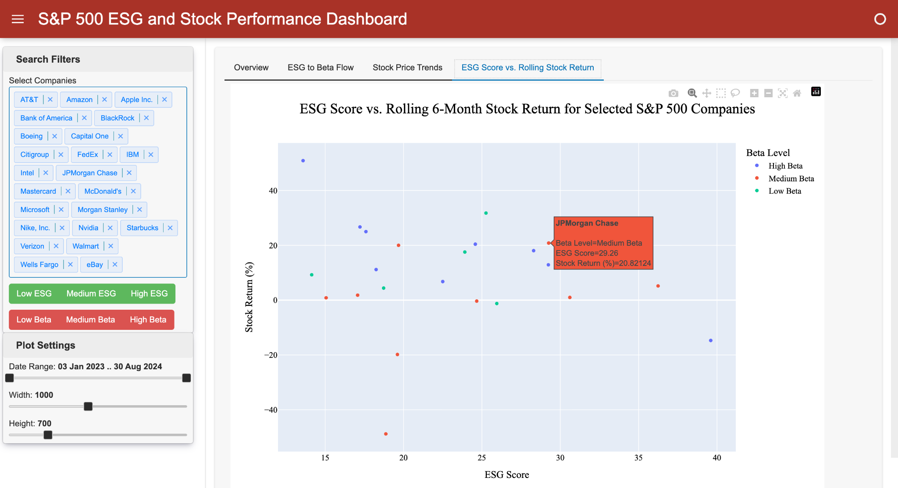

# S&P 500 ESG & Stock Performance Dashboard

This interactive dashboard explores the relationship between S&P 500 **ESG (Environmental, Social, and Governance)** scores and stock performance in 2023-2024. 

The dashboard includes three main visualizations:

1. A **Sankey diagram** showing the flow from ESG dimensions to ESG levels to Beta levels (market risk)
2. A **line plot** for stock price trends over a selected time range, and
3. A **scatter plot** comparing ESG scores with **rolling 6-month stock returns**, colored by Beta level

The data comes from the Kaggle dataset:  
https://www.kaggle.com/datasets/rikinzala/s-and-p-500-esg-and-stocks-data-2023-24

---

## Built With

This project was built using:

- **Python**
- **pandas** – data manipulation
- **plotly** – interactive visualizations
- **matplotlib** – colormap utilities
- **panel (HoloViz)** – interactive dashboard layout

---

## Getting Started

Follow the steps below to run the project locally.

### Prerequisites

- Python 3+ recommended
- pip package manager

### Installation

1. Clone the repository
   ```sh
   git clone https://github.com/your_github_username/repo_name.git
   ```

2. Navigate to the project directory
   ```sh
   cd your-repo-name
   ```

3. Install the required packages (if you have not already)
   ```sh
   pip install -r requirements.txt
   ```

4. Data is included in data/

5. Run the dashboard
   ```sh
   python -m src.esgstocks_explore
   ```

Open the provided local Panel URL in your browser to interact with the dashboard.

---

## Usage

This dashboard is split into three main tabs:

### 1. ESG Dimension to Beta Level Flow

A Sankey diagram showing how companies' individual ESG dimension scores (Environmental, Social, and Governance) aggregate into:

- **ESG levels** – based on percentile cutoffs (High, Medium, Low),
- **Beta levels** – standard market risk categories: Low (β < 0.8), Medium (0.8–1.2), and High (β > 1.2).

**Widgets:**

- Company selector
- ESG Level filter
- Beta Level filter
- Width and Height sliders (for adjusting the diagram size)

This helps you see how subsets of companies distribute across sustainability and market risk categories.

---

### 2. Stock Price Trends Over Time

A line plot displaying stock price trends for selected companies within a chosen date range.

**Widgets:**

- Company selector
- Date range slider (has start/end control)
- Width and Height sliders

This allows users to explore stock price trajectories over user-selected time periods.

---

### 3. ESG Score vs. Rolling Stock Return

A scatter plot comparing ESG scores with **rolling 6-month stock returns** ending on the selected date.

**Important:**

- Returns are computed as the percentage change over the **6 months ending on the date** chosen by the slider's end handle.
- This does not imply causality — it shows associations across companies with different ESG and Beta levels.

**Widgets:**

- Company selector
- Beta Level filter
- Date range slider (used only for return end date here)
- Width and Height sliders

---

## Results & Visualizations

### ESG Dimension to Beta Level Flow

**Sankey diagram** showing how selected S&P 500 companies flow from ESG dimensions into ESG levels and Beta (market risk) levels.

<p align="center">
  
</p>

<br>

### Stock Price Trends Over Time

**Line plot** displaying stock price trends for selected companies over a user-specified date range.

<p align="center">
  
</p>

<br>

### ESG Score vs. Rolling Stock Return

**Scatter plot** comparing ESG scores with rolling 6-month stock returns (ending on the selected date), colored by beta level to highlight differences in market risk.

<p align="center">
  
</p>

---

## Methodology Notes

- **ESG Levels:** Computed using percentile rank within the ESG dataset (relative performance).
- **Beta Levels:** Categorized using standard finance cutoffs to represent market risk sensitivity.
- **Returns:** Rolling 6-month returns are backward-looking and fixed to a specific date for cross-company comparison.

---

## Acknowledgments

- Kaggle dataset by Rikin Zala: S and P 500 ESG and Stocks Data 2023-24
- pandas, plotly, matplotlib, and panel documentation and open-source contributors

---
